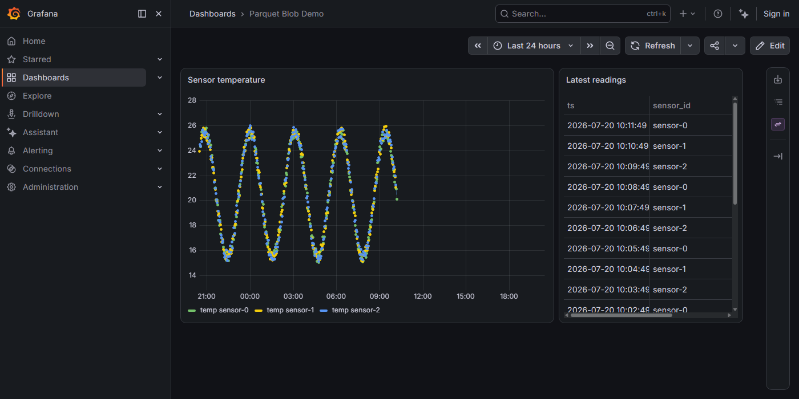
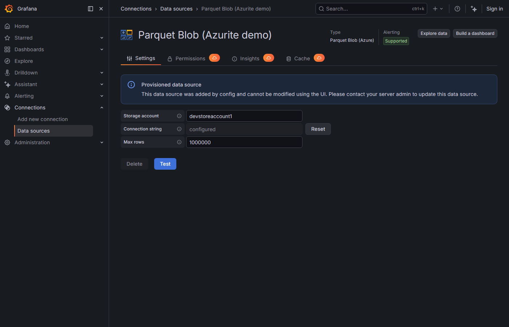
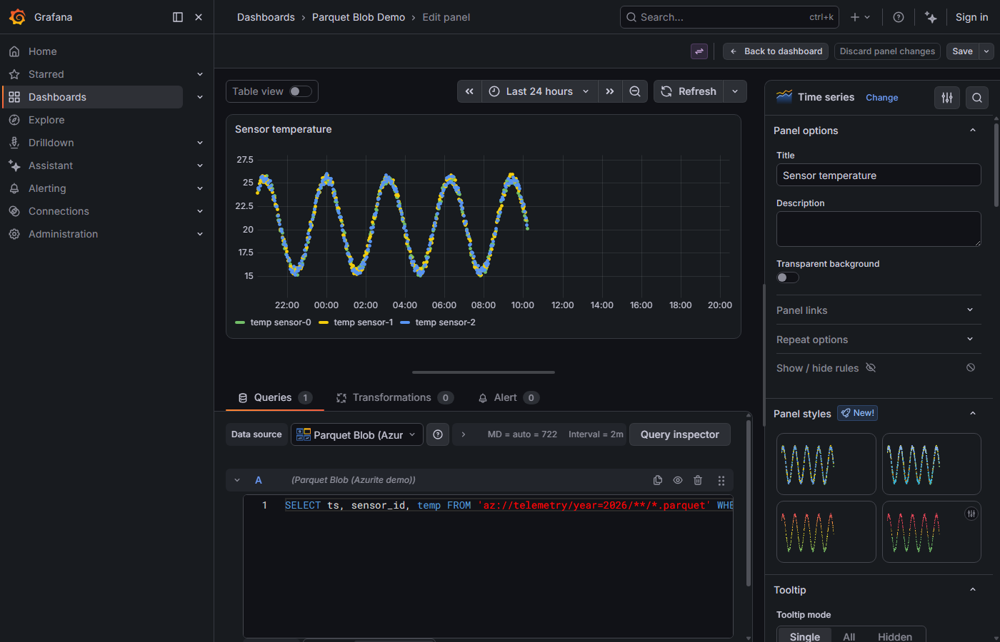

# Parquet Blob (Azure) — Grafana Datasource

Query Apache Parquet files sitting in Azure Blob Storage with full SQL — joins, CTEs, window
functions, `az://container/path/**/*.parquet` globs, Hive partitioning — powered by an embedded
[DuckDB](https://duckdb.org/) engine. No ETL, no separate query service: point the plugin at a
storage account and query the blobs directly.



## Requirements

- Grafana ≥ 12.3.0
- The backend is CGO/native, so it ships for: **linux/amd64, linux/arm64, darwin/arm64**. There is
  no Windows build — DuckDB does not publish an `azure` extension for the mingw platform the Go
  driver produces on Windows, so the plugin cannot load blob storage support there. Grafana
  running in Docker/Kubernetes on Linux — by far the common deployment shape — is unaffected.

## Configure

Add a new **Parquet Blob (Azure)** datasource and fill in:

- **Storage account** — the Azure storage account name.
- **Connection string** — stored encrypted (`secureJsonData`), never sent back to the browser.
- **Max rows** — per-query row cap, default 1,000,000.



Click **Save & Test**. A green result means the plugin authenticated against Azure; the health
check probes a container that shouldn't exist, so an auth-accepted 404 is treated as success.

## Query

Queries are raw DuckDB SQL against `az://` URLs:

```sql
SELECT ts, sensor_id, temp
FROM 'az://telemetry/year=2026/**/*.parquet'
WHERE $__timeFilter(ts)
ORDER BY ts
```

Globs (`**/*.parquet`) and Hive-style partition directories (`year=2026/month=01/...`) work
directly — DuckDB pushes predicates and column projection down into the Parquet reader. JOINs,
CTEs, and window functions are all standard SQL.



### Time macros

| Macro | Expands to |
|---|---|
| `$__timeFilter(col)` | `col >= TIMESTAMP '...' AND col <= TIMESTAMP '...'` (dashboard time range, UTC) |
| `$__timeFrom` / `$__timeFrom()` | `TIMESTAMP '...'` (dashboard range start, UTC) |
| `$__timeTo` / `$__timeTo()` | `TIMESTAMP '...'` (dashboard range end, UTC) |

### Formats

- **Table** — columns as returned, one row per SQL row.
- **Time series** — requires *long* format: a time column first, optional string label columns,
  then numeric value columns, sorted by time (`ORDER BY ts`). The plugin pivots this into Grafana's
  wide time-series format (one field per label combination) automatically.

### Template variables

Dashboard variables are expanded in the browser before the query reaches the backend. Add a
`sensor` variable and reference it directly in SQL:

```sql
WHERE $__timeFilter(ts) AND sensor_id = '$sensor'
```

### Row limit

Every query is wrapped in an outer `LIMIT maxRows + 1`. If the extra row is present, the response
carries a warning notice ("Row limit reached...") and the frame is truncated to `maxRows`. Raise
the **Max rows** datasource setting if you need more.

## Local demo

```bash
docker compose up -d
go run ./cmd/seed
```

Opens Grafana at http://localhost:3000 with Azurite, a provisioned datasource, and a demo
dashboard (`Parquet Blob Demo`) reading seeded sensor data.

## Provisioning

```yaml
apiVersion: 1
datasources:
  - name: Parquet Blob
    type: ashwathranjol-parquetblob-datasource
    access: proxy
    jsonData:
      accountName: <your-storage-account>
      maxRows: 1000000
    secureJsonData:
      connectionString: "DefaultEndpointsProtocol=https;AccountName=...;AccountKey=...;"
```

## Troubleshooting

- **"No connection string configured"** — set the connection string in datasource settings.
- **"Azure rejected the credentials"** — the storage account key/connection string is wrong or
  expired.
- **"Could not reach the storage account"** — network/endpoint problem; check the account name
  and that the Grafana host can reach `*.blob.core.windows.net` (or your custom endpoint).
- **"azure extension unavailable (plugin packaging problem)"** — the plugin zip is missing its
  bundled `duckdb_extensions/` directory for the host platform; re-download the release asset.
- SQL errors from DuckDB pass straight through to the panel (with any connection string
  redacted), since they're usually the fastest way to find a typo or a bad path.

## v1 limitations

Deliberate cuts, all reversible in a later release:

- No visual query builder — raw SQL only.
- Auth is connection string / account key only (no SAS token, service principal, or managed
  identity).
- No file/container browser UI.
- No query result caching.
- Azure Blob Storage only (no GCS/S3).

## License

Apache 2.0 — see [LICENSE](LICENSE).
